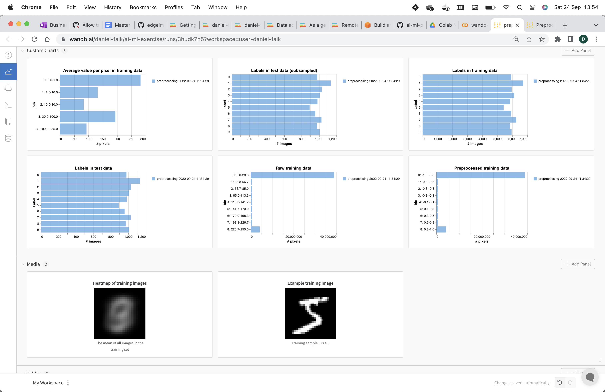
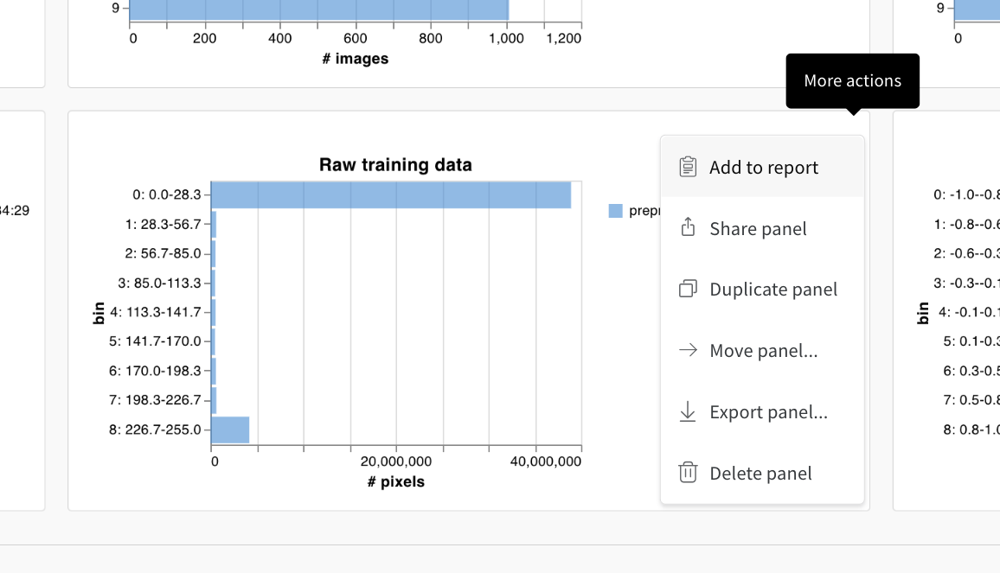
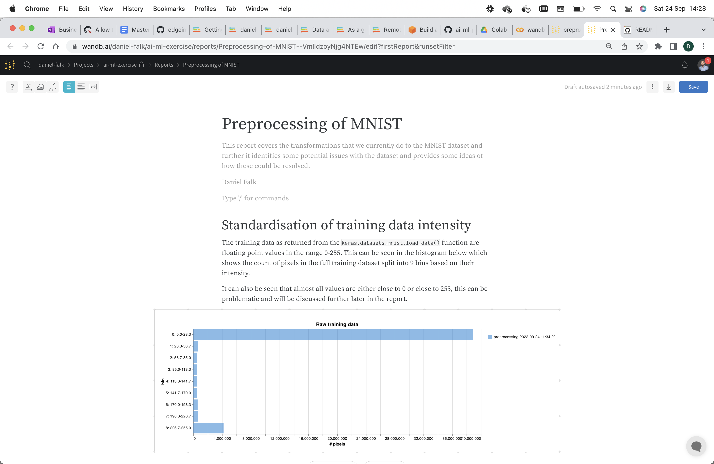
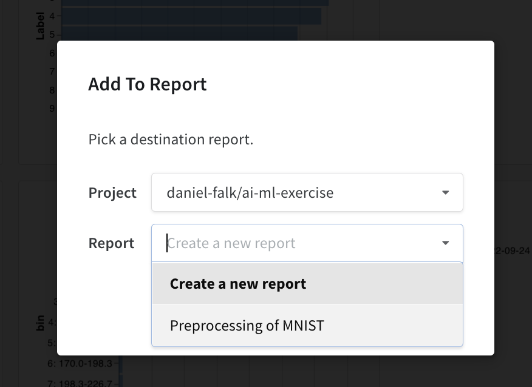
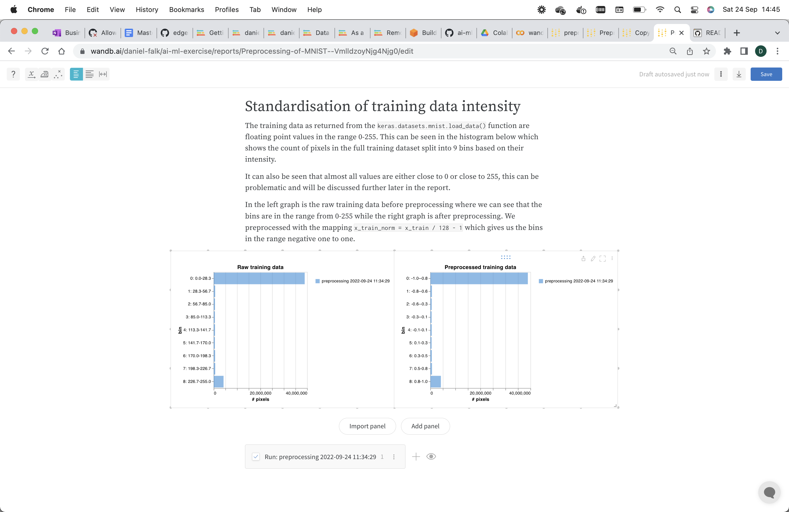
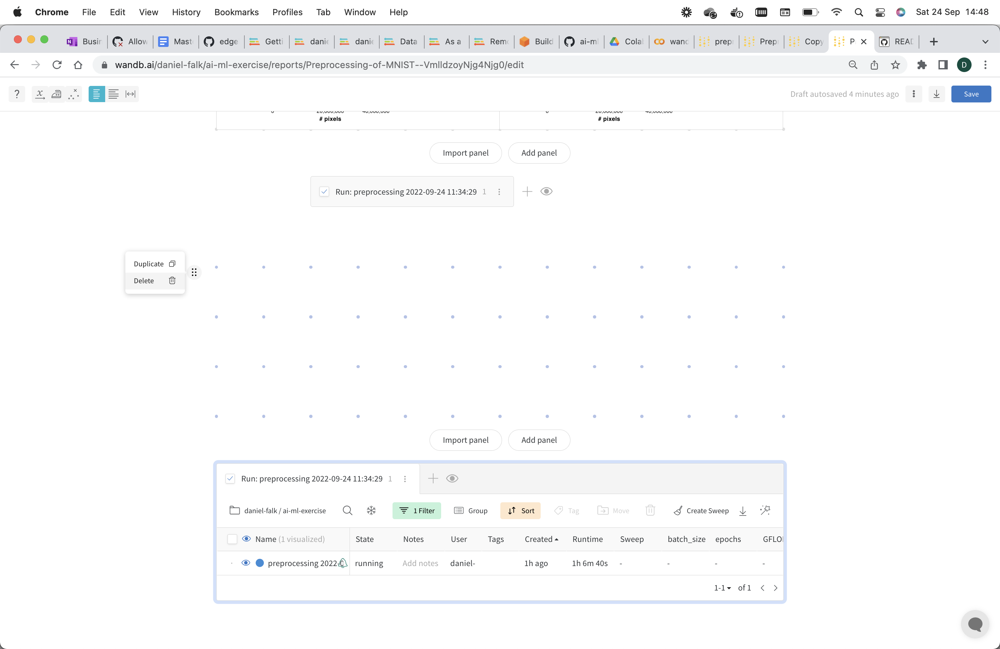
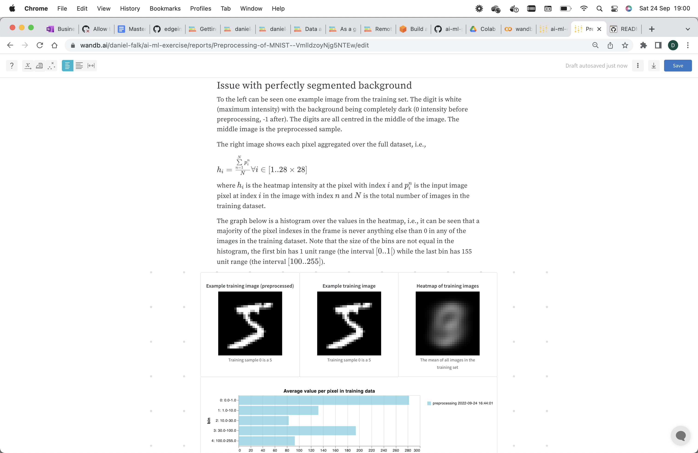
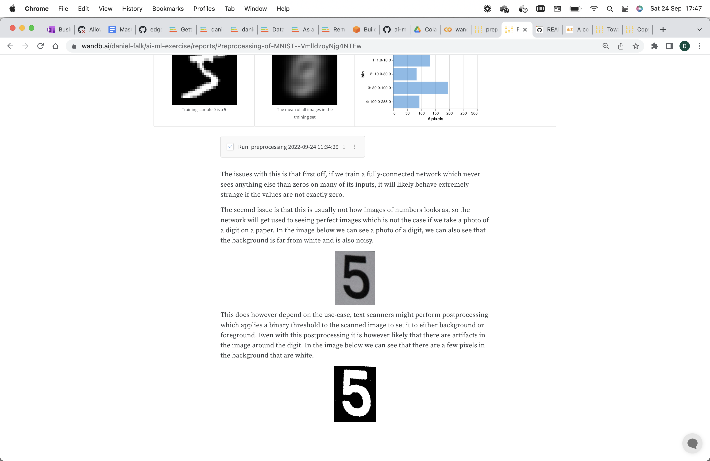
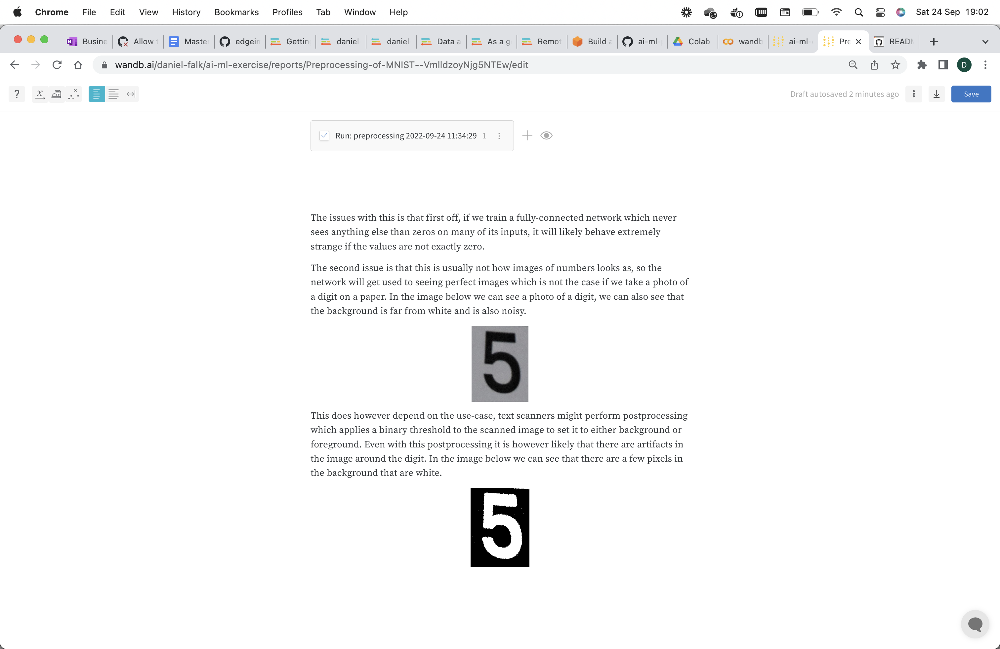

# Creating reports in Weights and Biases
Creating reports is an important part of the data science workflow. Machine learning projects does often not have as visible phases and deliveries as in traditional software development. Therefore reports are an important part of e.g. the *CRISP-DM methodology* and are valuable both to show progress to stakeholders in order to secure further project financing but also as handover between engineers or as a scratch-pad to organize your own thoughts and ideas.

This exercise covers the creation of reports based on the logged diagrams in a Weights and Biases workspace.

## Run the code to create the graphs
Before doing this exercise you should be familiar with how logging to Weights and Biases are done. You can learn that in the [logging training with Weights and Biases exercise](https://github.com/daniel-falk/ai-ml-principles-exercises/tree/main/ML-training/logging-trainings-with-WandB) in this repository. This exercise contains a notebook `preprocess_with_wandb.ipynb` which performs the actual analysis and preprocessing of the data used for an MNIST training. This is always the first step before starting with any modelling. Once the preprocessing script has been run you will have a few graphs logged to your Weights and Biases workspace. You can open the notebook in [Google Colab using this link](https://colab.research.google.com/github/daniel-falk/ai-ml-principles-exercises/blob/main/ML-training/creating-reports-with-WandB/preprocess_with_wandb.ipynb).

Already from a simple data exploration and preprocessing phase like this there are a lot of graphs in the Weights and Biases workspace created during a single run.



## Creating the report
The idea with reports is that we can pick and choose graphs and media from one or multiple runs and add them to reports where we complement with text, formulas, images, etc., to convey our message. In a report we can place and format the graphs much more freely than we can in the Weights and Biases workspace. Create a new report by pressing the three dots in the right-top corner of the `Raw training data` graph, then select `Add to report`. Let the `Report` drop-down be `Create new report`.



Now we can see that this graph that we selected is placed in an empty report. Give the report a name, description and describe what we can see in the graph. You do this by pressing where you want to write. You can also make use of markdown notation to format the code, e.g., single lines of code can be highlighted by writing backticks around it like ``` This is my text with `with_my_variable = my_function()`. ```.



Next we want to add another graph to our report. Make sure that the report draft is saved by pressing the `Save` button to the top-right corner. Then go back to the workspace where you have all your graphs and press the three dots on the `Preprocessed training data` graph. If the saved report is not available in the drop-down, you might need to refresh to browser window.



After adding the new graph to the report you can move it around by dragging in the top of it. You can make the graphs larger or smaller by dragging in the bottom right corner of them. Move the new graph next to the first graph and add a text explaining the difference of them.



If you did not change the drop-down when adding the new graph you should have got it placed in a new section. Each section is an area for graphs acompanied by a selection tool for the run sets. We will look more into these later to understand how the graphs are dynamic and will be updated automatically when the code is run again. For now, you might have an empty section if you moved the graph from the new section to the first section, this can be removed by pressing the six dots to the left of the empty area.



Next create a new section and present the graphs with the number of samples from each digit in the testset. You can create a level-2 header by writing two hashtags before the text like `## my header`.


Now we can add the three images (the example image, preprocessed example image and the heatmap) from the `Media` section in the Weights and Biases workspace and the histogram of values in the heatmap from the `Custom charts` section. The analysis starts to get a bit complicated so we might want to describe it in a mathematicall language so that engineers who are not confortable with python also can understand how the heatmap and histogram are created. We can add mathematical formulas using the Latex language by pressing the dollar sign (`$`) two times. This will open an input field where we can write Latex, e.g., `h_i = \frac{\sum\limits_{n=1}^N p_i^n}{N} \forall i \in [1..28\times28]` for the advanced formula.



Continue the section with explaining how these perfect images of digits differ from images we might see in a real world use-case. You can add images by pressing the forward slash key (`/`) and selecting `Image` in the meny. You can find the images of the digits in the `image` folder of this repository.



## The graphs in the report are dynamic
Once we have saved the report we might run new experiments in the same Weights and Biases project. After doing that we might want our graphs in the report to be based on the updated results. By default when we create the report the graphs gets locked to the last run in the project. If we want a dynamic report which evolves together with our experiments we can change this setting.

Go to the edit page for the report and click on the run name in the gray box under the first graphs in the top of the report. This expands a table which shows the runs we have done. Press the `Filter` button and change the filter from a specific run ID to e.g. everything from todays date. If you only have run the notebook once, then this will not yet do any difference. Do the same for the section with the images of the digit and the heatmap. You can hide the run-selector on the section with the labels by clicking the eye icon next to the run selector. Save the report.



Now go to the Jupyter Notebook again and add a new cell after the normalization in the preprocessing but before creating the histogram. This cell will add some random noise to the image to make it look a bit more natural.
```
x_train_norm *= np.random.random(size=x_train_norm.shape)
```

Rerun the full notebook. This should create a new run in Weights and Biases, and this new run should also be picked up by the report (you might need to refresh the page) which will now show both of the runs and a selection table below where you can hide specific runs by clicking the eye icon next to it.

## Share the report with others
Finally when you are happy with the report you can share it with others. In the top right corner, click the share button and give people access by email or by clicking the slider to enable public access for anywith with the link.

